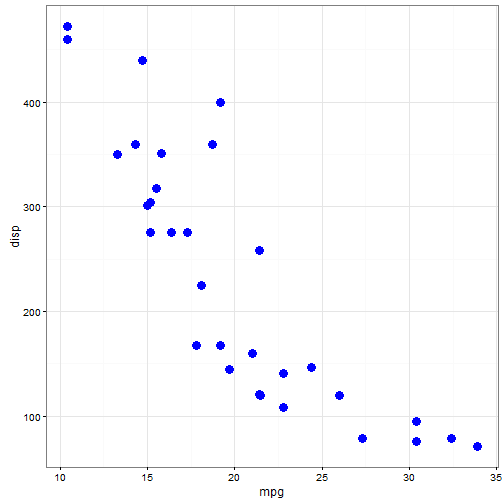
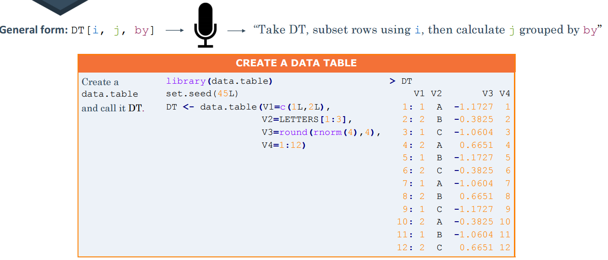

<style type="text/css">
.small-code pre code {
   font-size: 0.9em;
}
</style>

Data Manipulation in R & Python: the dplyr, data.table, and dplython packages
========================================================

<span style = "color:darkred"> _Som B. Bohora_ </span>

[Department of Pediatrics](http://www.oumedicine.com/pediatrics)

University of Oklahoma Health Sciences Center

October 04, 2016

Outline of the presentation
========================================================
1. **`dplyr`** in R
1. **`dplython`** in python
1. **`data.table`** in R


why `dplyr`?
========================================================
1. Speed and performance
1. Direct connection to and analysis within external databases
1. Function chaining 
1. Syntax simplicity and ease of use (SQL flavor)

`dplyr` verbs
========================================================
6 key operations

* **filter**: filter the rows of a data frame
* **mutate**: modify or create new columns
* **group by**: set grouping variables
* **summarise**: aggregate a data frame
* **arrange**: sort columns of a data frame
* **select**: select a set of columns

filter
========================================================

```r
ds <- iris[,3:5]
dplyr::filter(ds, Species == "setosa", Petal.Width > 0.2)
```

```
   Petal.Length Petal.Width Species
1           1.7         0.4  setosa
2           1.4         0.3  setosa
3           1.5         0.4  setosa
4           1.3         0.4  setosa
5           1.4         0.3  setosa
6           1.7         0.3  setosa
7           1.5         0.3  setosa
8           1.5         0.4  setosa
9           1.7         0.5  setosa
10          1.6         0.4  setosa
11          1.5         0.4  setosa
12          1.3         0.3  setosa
13          1.3         0.3  setosa
14          1.6         0.6  setosa
15          1.9         0.4  setosa
16          1.4         0.3  setosa
```

mutate (transmute??)
========================================================

```r
dplyr::mutate(ds, ratio_length_width = Petal.Length / Petal.Width,
                  sqrt_width = sqrt(Petal.Width))
```

```
    Petal.Length Petal.Width    Species ratio_length_width sqrt_width
1            1.4         0.2     setosa           7.000000  0.4472136
2            1.4         0.2     setosa           7.000000  0.4472136
3            1.3         0.2     setosa           6.500000  0.4472136
4            1.5         0.2     setosa           7.500000  0.4472136
5            1.4         0.2     setosa           7.000000  0.4472136
6            1.7         0.4     setosa           4.250000  0.6324555
7            1.4         0.3     setosa           4.666667  0.5477226
8            1.5         0.2     setosa           7.500000  0.4472136
9            1.4         0.2     setosa           7.000000  0.4472136
10           1.5         0.1     setosa          15.000000  0.3162278
11           1.5         0.2     setosa           7.500000  0.4472136
12           1.6         0.2     setosa           8.000000  0.4472136
13           1.4         0.1     setosa          14.000000  0.3162278
14           1.1         0.1     setosa          11.000000  0.3162278
15           1.2         0.2     setosa           6.000000  0.4472136
16           1.5         0.4     setosa           3.750000  0.6324555
17           1.3         0.4     setosa           3.250000  0.6324555
18           1.4         0.3     setosa           4.666667  0.5477226
19           1.7         0.3     setosa           5.666667  0.5477226
20           1.5         0.3     setosa           5.000000  0.5477226
21           1.7         0.2     setosa           8.500000  0.4472136
22           1.5         0.4     setosa           3.750000  0.6324555
23           1.0         0.2     setosa           5.000000  0.4472136
24           1.7         0.5     setosa           3.400000  0.7071068
25           1.9         0.2     setosa           9.500000  0.4472136
26           1.6         0.2     setosa           8.000000  0.4472136
27           1.6         0.4     setosa           4.000000  0.6324555
28           1.5         0.2     setosa           7.500000  0.4472136
29           1.4         0.2     setosa           7.000000  0.4472136
30           1.6         0.2     setosa           8.000000  0.4472136
31           1.6         0.2     setosa           8.000000  0.4472136
32           1.5         0.4     setosa           3.750000  0.6324555
33           1.5         0.1     setosa          15.000000  0.3162278
34           1.4         0.2     setosa           7.000000  0.4472136
35           1.5         0.2     setosa           7.500000  0.4472136
36           1.2         0.2     setosa           6.000000  0.4472136
37           1.3         0.2     setosa           6.500000  0.4472136
38           1.4         0.1     setosa          14.000000  0.3162278
39           1.3         0.2     setosa           6.500000  0.4472136
40           1.5         0.2     setosa           7.500000  0.4472136
41           1.3         0.3     setosa           4.333333  0.5477226
42           1.3         0.3     setosa           4.333333  0.5477226
43           1.3         0.2     setosa           6.500000  0.4472136
44           1.6         0.6     setosa           2.666667  0.7745967
45           1.9         0.4     setosa           4.750000  0.6324555
46           1.4         0.3     setosa           4.666667  0.5477226
47           1.6         0.2     setosa           8.000000  0.4472136
48           1.4         0.2     setosa           7.000000  0.4472136
49           1.5         0.2     setosa           7.500000  0.4472136
50           1.4         0.2     setosa           7.000000  0.4472136
51           4.7         1.4 versicolor           3.357143  1.1832160
52           4.5         1.5 versicolor           3.000000  1.2247449
53           4.9         1.5 versicolor           3.266667  1.2247449
54           4.0         1.3 versicolor           3.076923  1.1401754
55           4.6         1.5 versicolor           3.066667  1.2247449
56           4.5         1.3 versicolor           3.461538  1.1401754
57           4.7         1.6 versicolor           2.937500  1.2649111
58           3.3         1.0 versicolor           3.300000  1.0000000
59           4.6         1.3 versicolor           3.538462  1.1401754
60           3.9         1.4 versicolor           2.785714  1.1832160
61           3.5         1.0 versicolor           3.500000  1.0000000
62           4.2         1.5 versicolor           2.800000  1.2247449
63           4.0         1.0 versicolor           4.000000  1.0000000
64           4.7         1.4 versicolor           3.357143  1.1832160
65           3.6         1.3 versicolor           2.769231  1.1401754
66           4.4         1.4 versicolor           3.142857  1.1832160
67           4.5         1.5 versicolor           3.000000  1.2247449
68           4.1         1.0 versicolor           4.100000  1.0000000
69           4.5         1.5 versicolor           3.000000  1.2247449
70           3.9         1.1 versicolor           3.545455  1.0488088
71           4.8         1.8 versicolor           2.666667  1.3416408
72           4.0         1.3 versicolor           3.076923  1.1401754
73           4.9         1.5 versicolor           3.266667  1.2247449
74           4.7         1.2 versicolor           3.916667  1.0954451
75           4.3         1.3 versicolor           3.307692  1.1401754
76           4.4         1.4 versicolor           3.142857  1.1832160
77           4.8         1.4 versicolor           3.428571  1.1832160
78           5.0         1.7 versicolor           2.941176  1.3038405
79           4.5         1.5 versicolor           3.000000  1.2247449
80           3.5         1.0 versicolor           3.500000  1.0000000
81           3.8         1.1 versicolor           3.454545  1.0488088
82           3.7         1.0 versicolor           3.700000  1.0000000
83           3.9         1.2 versicolor           3.250000  1.0954451
84           5.1         1.6 versicolor           3.187500  1.2649111
85           4.5         1.5 versicolor           3.000000  1.2247449
86           4.5         1.6 versicolor           2.812500  1.2649111
87           4.7         1.5 versicolor           3.133333  1.2247449
88           4.4         1.3 versicolor           3.384615  1.1401754
89           4.1         1.3 versicolor           3.153846  1.1401754
90           4.0         1.3 versicolor           3.076923  1.1401754
91           4.4         1.2 versicolor           3.666667  1.0954451
92           4.6         1.4 versicolor           3.285714  1.1832160
93           4.0         1.2 versicolor           3.333333  1.0954451
94           3.3         1.0 versicolor           3.300000  1.0000000
95           4.2         1.3 versicolor           3.230769  1.1401754
96           4.2         1.2 versicolor           3.500000  1.0954451
97           4.2         1.3 versicolor           3.230769  1.1401754
98           4.3         1.3 versicolor           3.307692  1.1401754
99           3.0         1.1 versicolor           2.727273  1.0488088
100          4.1         1.3 versicolor           3.153846  1.1401754
101          6.0         2.5  virginica           2.400000  1.5811388
102          5.1         1.9  virginica           2.684211  1.3784049
103          5.9         2.1  virginica           2.809524  1.4491377
104          5.6         1.8  virginica           3.111111  1.3416408
105          5.8         2.2  virginica           2.636364  1.4832397
106          6.6         2.1  virginica           3.142857  1.4491377
107          4.5         1.7  virginica           2.647059  1.3038405
108          6.3         1.8  virginica           3.500000  1.3416408
109          5.8         1.8  virginica           3.222222  1.3416408
110          6.1         2.5  virginica           2.440000  1.5811388
111          5.1         2.0  virginica           2.550000  1.4142136
112          5.3         1.9  virginica           2.789474  1.3784049
113          5.5         2.1  virginica           2.619048  1.4491377
114          5.0         2.0  virginica           2.500000  1.4142136
115          5.1         2.4  virginica           2.125000  1.5491933
116          5.3         2.3  virginica           2.304348  1.5165751
117          5.5         1.8  virginica           3.055556  1.3416408
118          6.7         2.2  virginica           3.045455  1.4832397
119          6.9         2.3  virginica           3.000000  1.5165751
120          5.0         1.5  virginica           3.333333  1.2247449
121          5.7         2.3  virginica           2.478261  1.5165751
122          4.9         2.0  virginica           2.450000  1.4142136
123          6.7         2.0  virginica           3.350000  1.4142136
124          4.9         1.8  virginica           2.722222  1.3416408
125          5.7         2.1  virginica           2.714286  1.4491377
126          6.0         1.8  virginica           3.333333  1.3416408
127          4.8         1.8  virginica           2.666667  1.3416408
128          4.9         1.8  virginica           2.722222  1.3416408
129          5.6         2.1  virginica           2.666667  1.4491377
130          5.8         1.6  virginica           3.625000  1.2649111
131          6.1         1.9  virginica           3.210526  1.3784049
132          6.4         2.0  virginica           3.200000  1.4142136
133          5.6         2.2  virginica           2.545455  1.4832397
134          5.1         1.5  virginica           3.400000  1.2247449
135          5.6         1.4  virginica           4.000000  1.1832160
136          6.1         2.3  virginica           2.652174  1.5165751
137          5.6         2.4  virginica           2.333333  1.5491933
138          5.5         1.8  virginica           3.055556  1.3416408
139          4.8         1.8  virginica           2.666667  1.3416408
140          5.4         2.1  virginica           2.571429  1.4491377
141          5.6         2.4  virginica           2.333333  1.5491933
142          5.1         2.3  virginica           2.217391  1.5165751
143          5.1         1.9  virginica           2.684211  1.3784049
144          5.9         2.3  virginica           2.565217  1.5165751
145          5.7         2.5  virginica           2.280000  1.5811388
146          5.2         2.3  virginica           2.260870  1.5165751
147          5.0         1.9  virginica           2.631579  1.3784049
148          5.2         2.0  virginica           2.600000  1.4142136
149          5.4         2.3  virginica           2.347826  1.5165751
150          5.1         1.8  virginica           2.833333  1.3416408
```

mutate (referring to newly created columns)
========================================================

```r
dplyr::mutate(ds, ratio_length_width = Petal.Length / Petal.Width,
                  sqrt_width = sqrt(Petal.Width),
                  sq_width = sqrt_width^2)
```

```
    Petal.Length Petal.Width    Species ratio_length_width sqrt_width
1            1.4         0.2     setosa           7.000000  0.4472136
2            1.4         0.2     setosa           7.000000  0.4472136
3            1.3         0.2     setosa           6.500000  0.4472136
4            1.5         0.2     setosa           7.500000  0.4472136
5            1.4         0.2     setosa           7.000000  0.4472136
6            1.7         0.4     setosa           4.250000  0.6324555
7            1.4         0.3     setosa           4.666667  0.5477226
8            1.5         0.2     setosa           7.500000  0.4472136
9            1.4         0.2     setosa           7.000000  0.4472136
10           1.5         0.1     setosa          15.000000  0.3162278
11           1.5         0.2     setosa           7.500000  0.4472136
12           1.6         0.2     setosa           8.000000  0.4472136
13           1.4         0.1     setosa          14.000000  0.3162278
14           1.1         0.1     setosa          11.000000  0.3162278
15           1.2         0.2     setosa           6.000000  0.4472136
16           1.5         0.4     setosa           3.750000  0.6324555
17           1.3         0.4     setosa           3.250000  0.6324555
18           1.4         0.3     setosa           4.666667  0.5477226
19           1.7         0.3     setosa           5.666667  0.5477226
20           1.5         0.3     setosa           5.000000  0.5477226
21           1.7         0.2     setosa           8.500000  0.4472136
22           1.5         0.4     setosa           3.750000  0.6324555
23           1.0         0.2     setosa           5.000000  0.4472136
24           1.7         0.5     setosa           3.400000  0.7071068
25           1.9         0.2     setosa           9.500000  0.4472136
26           1.6         0.2     setosa           8.000000  0.4472136
27           1.6         0.4     setosa           4.000000  0.6324555
28           1.5         0.2     setosa           7.500000  0.4472136
29           1.4         0.2     setosa           7.000000  0.4472136
30           1.6         0.2     setosa           8.000000  0.4472136
31           1.6         0.2     setosa           8.000000  0.4472136
32           1.5         0.4     setosa           3.750000  0.6324555
33           1.5         0.1     setosa          15.000000  0.3162278
34           1.4         0.2     setosa           7.000000  0.4472136
35           1.5         0.2     setosa           7.500000  0.4472136
36           1.2         0.2     setosa           6.000000  0.4472136
37           1.3         0.2     setosa           6.500000  0.4472136
38           1.4         0.1     setosa          14.000000  0.3162278
39           1.3         0.2     setosa           6.500000  0.4472136
40           1.5         0.2     setosa           7.500000  0.4472136
41           1.3         0.3     setosa           4.333333  0.5477226
42           1.3         0.3     setosa           4.333333  0.5477226
43           1.3         0.2     setosa           6.500000  0.4472136
44           1.6         0.6     setosa           2.666667  0.7745967
45           1.9         0.4     setosa           4.750000  0.6324555
46           1.4         0.3     setosa           4.666667  0.5477226
47           1.6         0.2     setosa           8.000000  0.4472136
48           1.4         0.2     setosa           7.000000  0.4472136
49           1.5         0.2     setosa           7.500000  0.4472136
50           1.4         0.2     setosa           7.000000  0.4472136
51           4.7         1.4 versicolor           3.357143  1.1832160
52           4.5         1.5 versicolor           3.000000  1.2247449
53           4.9         1.5 versicolor           3.266667  1.2247449
54           4.0         1.3 versicolor           3.076923  1.1401754
55           4.6         1.5 versicolor           3.066667  1.2247449
56           4.5         1.3 versicolor           3.461538  1.1401754
57           4.7         1.6 versicolor           2.937500  1.2649111
58           3.3         1.0 versicolor           3.300000  1.0000000
59           4.6         1.3 versicolor           3.538462  1.1401754
60           3.9         1.4 versicolor           2.785714  1.1832160
61           3.5         1.0 versicolor           3.500000  1.0000000
62           4.2         1.5 versicolor           2.800000  1.2247449
63           4.0         1.0 versicolor           4.000000  1.0000000
64           4.7         1.4 versicolor           3.357143  1.1832160
65           3.6         1.3 versicolor           2.769231  1.1401754
66           4.4         1.4 versicolor           3.142857  1.1832160
67           4.5         1.5 versicolor           3.000000  1.2247449
68           4.1         1.0 versicolor           4.100000  1.0000000
69           4.5         1.5 versicolor           3.000000  1.2247449
70           3.9         1.1 versicolor           3.545455  1.0488088
71           4.8         1.8 versicolor           2.666667  1.3416408
72           4.0         1.3 versicolor           3.076923  1.1401754
73           4.9         1.5 versicolor           3.266667  1.2247449
74           4.7         1.2 versicolor           3.916667  1.0954451
75           4.3         1.3 versicolor           3.307692  1.1401754
76           4.4         1.4 versicolor           3.142857  1.1832160
77           4.8         1.4 versicolor           3.428571  1.1832160
78           5.0         1.7 versicolor           2.941176  1.3038405
79           4.5         1.5 versicolor           3.000000  1.2247449
80           3.5         1.0 versicolor           3.500000  1.0000000
81           3.8         1.1 versicolor           3.454545  1.0488088
82           3.7         1.0 versicolor           3.700000  1.0000000
83           3.9         1.2 versicolor           3.250000  1.0954451
84           5.1         1.6 versicolor           3.187500  1.2649111
85           4.5         1.5 versicolor           3.000000  1.2247449
86           4.5         1.6 versicolor           2.812500  1.2649111
87           4.7         1.5 versicolor           3.133333  1.2247449
88           4.4         1.3 versicolor           3.384615  1.1401754
89           4.1         1.3 versicolor           3.153846  1.1401754
90           4.0         1.3 versicolor           3.076923  1.1401754
91           4.4         1.2 versicolor           3.666667  1.0954451
92           4.6         1.4 versicolor           3.285714  1.1832160
93           4.0         1.2 versicolor           3.333333  1.0954451
94           3.3         1.0 versicolor           3.300000  1.0000000
95           4.2         1.3 versicolor           3.230769  1.1401754
96           4.2         1.2 versicolor           3.500000  1.0954451
97           4.2         1.3 versicolor           3.230769  1.1401754
98           4.3         1.3 versicolor           3.307692  1.1401754
99           3.0         1.1 versicolor           2.727273  1.0488088
100          4.1         1.3 versicolor           3.153846  1.1401754
101          6.0         2.5  virginica           2.400000  1.5811388
102          5.1         1.9  virginica           2.684211  1.3784049
103          5.9         2.1  virginica           2.809524  1.4491377
104          5.6         1.8  virginica           3.111111  1.3416408
105          5.8         2.2  virginica           2.636364  1.4832397
106          6.6         2.1  virginica           3.142857  1.4491377
107          4.5         1.7  virginica           2.647059  1.3038405
108          6.3         1.8  virginica           3.500000  1.3416408
109          5.8         1.8  virginica           3.222222  1.3416408
110          6.1         2.5  virginica           2.440000  1.5811388
111          5.1         2.0  virginica           2.550000  1.4142136
112          5.3         1.9  virginica           2.789474  1.3784049
113          5.5         2.1  virginica           2.619048  1.4491377
114          5.0         2.0  virginica           2.500000  1.4142136
115          5.1         2.4  virginica           2.125000  1.5491933
116          5.3         2.3  virginica           2.304348  1.5165751
117          5.5         1.8  virginica           3.055556  1.3416408
118          6.7         2.2  virginica           3.045455  1.4832397
119          6.9         2.3  virginica           3.000000  1.5165751
120          5.0         1.5  virginica           3.333333  1.2247449
121          5.7         2.3  virginica           2.478261  1.5165751
122          4.9         2.0  virginica           2.450000  1.4142136
123          6.7         2.0  virginica           3.350000  1.4142136
124          4.9         1.8  virginica           2.722222  1.3416408
125          5.7         2.1  virginica           2.714286  1.4491377
126          6.0         1.8  virginica           3.333333  1.3416408
127          4.8         1.8  virginica           2.666667  1.3416408
128          4.9         1.8  virginica           2.722222  1.3416408
129          5.6         2.1  virginica           2.666667  1.4491377
130          5.8         1.6  virginica           3.625000  1.2649111
131          6.1         1.9  virginica           3.210526  1.3784049
132          6.4         2.0  virginica           3.200000  1.4142136
133          5.6         2.2  virginica           2.545455  1.4832397
134          5.1         1.5  virginica           3.400000  1.2247449
135          5.6         1.4  virginica           4.000000  1.1832160
136          6.1         2.3  virginica           2.652174  1.5165751
137          5.6         2.4  virginica           2.333333  1.5491933
138          5.5         1.8  virginica           3.055556  1.3416408
139          4.8         1.8  virginica           2.666667  1.3416408
140          5.4         2.1  virginica           2.571429  1.4491377
141          5.6         2.4  virginica           2.333333  1.5491933
142          5.1         2.3  virginica           2.217391  1.5165751
143          5.1         1.9  virginica           2.684211  1.3784049
144          5.9         2.3  virginica           2.565217  1.5165751
145          5.7         2.5  virginica           2.280000  1.5811388
146          5.2         2.3  virginica           2.260870  1.5165751
147          5.0         1.9  virginica           2.631579  1.3784049
148          5.2         2.0  virginica           2.600000  1.4142136
149          5.4         2.3  virginica           2.347826  1.5165751
150          5.1         1.8  virginica           2.833333  1.3416408
    sq_width
1        0.2
2        0.2
3        0.2
4        0.2
5        0.2
6        0.4
7        0.3
8        0.2
9        0.2
10       0.1
11       0.2
12       0.2
13       0.1
14       0.1
15       0.2
16       0.4
17       0.4
18       0.3
19       0.3
20       0.3
21       0.2
22       0.4
23       0.2
24       0.5
25       0.2
26       0.2
27       0.4
28       0.2
29       0.2
30       0.2
31       0.2
32       0.4
33       0.1
34       0.2
35       0.2
36       0.2
37       0.2
38       0.1
39       0.2
40       0.2
41       0.3
42       0.3
43       0.2
44       0.6
45       0.4
46       0.3
47       0.2
48       0.2
49       0.2
50       0.2
51       1.4
52       1.5
53       1.5
54       1.3
55       1.5
56       1.3
57       1.6
58       1.0
59       1.3
60       1.4
61       1.0
62       1.5
63       1.0
64       1.4
65       1.3
66       1.4
67       1.5
68       1.0
69       1.5
70       1.1
71       1.8
72       1.3
73       1.5
74       1.2
75       1.3
76       1.4
77       1.4
78       1.7
79       1.5
80       1.0
81       1.1
82       1.0
83       1.2
84       1.6
85       1.5
86       1.6
87       1.5
88       1.3
89       1.3
90       1.3
91       1.2
92       1.4
93       1.2
94       1.0
95       1.3
96       1.2
97       1.3
98       1.3
99       1.1
100      1.3
101      2.5
102      1.9
103      2.1
104      1.8
105      2.2
106      2.1
107      1.7
108      1.8
109      1.8
110      2.5
111      2.0
112      1.9
113      2.1
114      2.0
115      2.4
116      2.3
117      1.8
118      2.2
119      2.3
120      1.5
121      2.3
122      2.0
123      2.0
124      1.8
125      2.1
126      1.8
127      1.8
128      1.8
129      2.1
130      1.6
131      1.9
132      2.0
133      2.2
134      1.5
135      1.4
136      2.3
137      2.4
138      1.8
139      1.8
140      2.1
141      2.4
142      2.3
143      1.9
144      2.3
145      2.5
146      2.3
147      1.9
148      2.0
149      2.3
150      1.8
```

group_by
========================================================

```r
grouped_ds <- dplyr::group_by(mtcars[,9:11], am, gear)
grouped_ds
```

```
Source: local data frame [32 x 3]
Groups: am, gear [4]

      am  gear  carb
*  <dbl> <dbl> <dbl>
1      1     4     4
2      1     4     4
3      1     4     1
4      0     3     1
5      0     3     2
6      0     3     1
7      0     3     4
8      0     4     2
9      0     4     2
10     0     4     4
# ... with 22 more rows
```

summarize
========================================================

```r
dplyr::summarize(mtcars, mean_mpg = mean(mpg))
```

```
  mean_mpg
1 20.09062
```

arrange
========================================================

```r
dplyr::arrange(mtcars[,1:3], desc(mpg), cyl)
```

```
    mpg cyl  disp
1  33.9   4  71.1
2  32.4   4  78.7
3  30.4   4  75.7
4  30.4   4  95.1
5  27.3   4  79.0
6  26.0   4 120.3
7  24.4   4 146.7
8  22.8   4 108.0
9  22.8   4 140.8
10 21.5   4 120.1
11 21.4   4 121.0
12 21.4   6 258.0
13 21.0   6 160.0
14 21.0   6 160.0
15 19.7   6 145.0
16 19.2   6 167.6
17 19.2   8 400.0
18 18.7   8 360.0
19 18.1   6 225.0
20 17.8   6 167.6
21 17.3   8 275.8
22 16.4   8 275.8
23 15.8   8 351.0
24 15.5   8 318.0
25 15.2   8 275.8
26 15.2   8 304.0
27 15.0   8 301.0
28 14.7   8 440.0
29 14.3   8 360.0
30 13.3   8 350.0
31 10.4   8 472.0
32 10.4   8 460.0
```

select
========================================================

```r
library(dplyr)
head(select(mtcars, 1:3),1)
```

```
          mpg cyl disp
Mazda RX4  21   6  160
```

```r
head(select(mtcars, mpg, cyl, disp),1)
```

```
          mpg cyl disp
Mazda RX4  21   6  160
```

```r
head(select(mtcars, mpg:disp),1)
```

```
          mpg cyl disp
Mazda RX4  21   6  160
```

`select` continued 
========================================================

```r
library(dplyr)
head(select(mtcars, contains('r')),2)
```

```
              drat gear carb
Mazda RX4      3.9    4    4
Mazda RX4 Wag  3.9    4    4
```

```r
head(select(mtcars, starts_with('d')),2)
```

```
              disp drat
Mazda RX4      160  3.9
Mazda RX4 Wag  160  3.9
```

Putting pieces together 
========================================================

```r
library(dplyr)
df <- mutate(mtcars, disp_cyl = disp/cyl)
df <- filter(df, disp_cyl > 30, mpg < 25)
df <- group_by(df, cyl, gear)
df
```

```
Source: local data frame [20 x 12]
Groups: cyl, gear [5]

     mpg   cyl  disp    hp  drat    wt  qsec    vs    am  gear  carb
   <dbl> <dbl> <dbl> <dbl> <dbl> <dbl> <dbl> <dbl> <dbl> <dbl> <dbl>
1   21.4     6 258.0   110  3.08 3.215 19.44     1     0     3     1
2   18.7     8 360.0   175  3.15 3.440 17.02     0     0     3     2
3   18.1     6 225.0   105  2.76 3.460 20.22     1     0     3     1
4   14.3     8 360.0   245  3.21 3.570 15.84     0     0     3     4
5   24.4     4 146.7    62  3.69 3.190 20.00     1     0     4     2
6   22.8     4 140.8    95  3.92 3.150 22.90     1     0     4     2
7   16.4     8 275.8   180  3.07 4.070 17.40     0     0     3     3
8   17.3     8 275.8   180  3.07 3.730 17.60     0     0     3     3
9   15.2     8 275.8   180  3.07 3.780 18.00     0     0     3     3
10  10.4     8 472.0   205  2.93 5.250 17.98     0     0     3     4
11  10.4     8 460.0   215  3.00 5.424 17.82     0     0     3     4
12  14.7     8 440.0   230  3.23 5.345 17.42     0     0     3     4
13  21.5     4 120.1    97  3.70 2.465 20.01     1     0     3     1
14  15.5     8 318.0   150  2.76 3.520 16.87     0     0     3     2
15  15.2     8 304.0   150  3.15 3.435 17.30     0     0     3     2
16  13.3     8 350.0   245  3.73 3.840 15.41     0     0     3     4
17  19.2     8 400.0   175  3.08 3.845 17.05     0     0     3     2
18  15.8     8 351.0   264  4.22 3.170 14.50     0     1     5     4
19  15.0     8 301.0   335  3.54 3.570 14.60     0     1     5     8
20  21.4     4 121.0   109  4.11 2.780 18.60     1     1     4     2
# ... with 1 more variables: disp_cyl <dbl>
```


Putting pieces together continued
========================================================


```r
summarise(
  group_by(
    filter(
      mutate(mtcars, disp_cyl = disp/cyl),
      disp_cyl > 30, 
      mpg > 23
    ),
    cyl,
    gear
  ),
  avg_d_cyl = mean(disp_cyl),
  min_d_cyl = min(disp_cyl)
)
```

```
Source: local data frame [2 x 4]
Groups: cyl [?]

    cyl  gear avg_d_cyl min_d_cyl
  <dbl> <dbl>     <dbl>     <dbl>
1     4     4    36.675    36.675
2     4     5    30.075    30.075
```

Using `%>%` from `magrittr`
====================================
Without pipes
```r
summarise(
  group_by(
    filter(
      mutate(mtcars, disp_cyl = disp/cyl),
      disp_cyl > 30, 
      mpg > 23
    ),
    cyl,
    gear
  ),
  avg_d_cyl = mean(disp_cyl),
  min_d_cyl = min(disp_cyl)
)
```
***
With pipes
```r
mtcars %>% 
  mutate(disp_cyl = disp/cyl) %>% 
  filter(disp_cyl>30, mpg>23) %>% 
  group_by(cyl, gear) %>% 
  summarise(
    avg_d_cyl = mean(disp_cyl),
    min_d_cyl = min(disp_cyl)
  )
```

Adding `ggplot2`
====================================

```r
library(magrittr); library(ggplot2)
mtcars %>% 
  dplyr::select(mpg, disp) %>%       
  dplyr::arrange(mpg, disp) %>%    
  ggplot(aes(x= mpg, y = disp)) + 
    geom_point(size = 4, col = "blue") + theme_bw()
```



`dplyr` and `dplython` functions
====================================

| `dplyr` | `dplython`   |
|:-----------|------------:|
| `filter`   |  `sift` |         
| `mutate`   |  same |        
| `group_by` |  same |          
| `summarize`|  same |            
| `arrange`  |  same |        
| `select`   |  same |   

`dplython` demonstration
====================================

`data.table` package
====================================
* Extension of `data.drame`
* Fast aggregation of large data
* Fast ordered joins
* Fast add/modify/delete of columns by group, and a fast file reader (fread)
* Natural and flexible syntax

`data.table` package continued
====================================



`data.table` package (row operations)
====================================


```r
DT[3:5,]

DT[3:5]

DT[V2 == "A"]

DT[ V2 %in% c("A", "C")]
```

`data.table` package (column operations)
====================================

```r
DT[, V2]

DT[, .(V2, V3)]   # .() is an alias to list() to result data.table object

DT[, sum(V4)]

DT[, .(sum(V1), sd(V3))]

DT[, .(avg = sum(V1), std = sd(V3))] # Assign column names

DT[, .(V1, std = sd(V3))] # columns reclycled if different lengths

DT[, {print(V2)   # multiple expressions
      plot(V3)
      NULL}]
```

`data.table` (group by)
====================================


```r
DT[, .(sum.V4 = sum(V4)), by=V1]

DT[, .(sum.V4 = sum(V4)), by=.(V1,V2)]

DT[1:5, .(sum.V4 = sum(V4)), by=.(V1,V2)] # only for subset rows

DT[, .N, by = V1]   # total no. of observations
# DT[V1 ==1, sum(V4)]
```

`data.table` (adding/updating columns, :=)
====================================

```r
DT[, V1 := round(exp(V1),2)]  # update V1
DT[, c("V1","V2") := list (round(exp(V1),2), LETTERS[4:6])] # update multiple columns
DT[, V1 := NULL] # remove column
DT[, c("V4","V3") := NULL] # remove multiple columns
```

`data.table` (setkey)
====================================

```r
setkey(DT,V2) 
DT["A"]
DT[c("A","C")]
DT[c("A","C"), sum(V4)]
```

`data.table` (advanced operations)
====================================

```r
DT[.N-2] # second row
DT[, .N]  # no. of rows
DT[,.(V2,V3)]  # or
DT[,list(V2,V3)] 
DT[,mean(V3), by= .(V1,V2)] 
```

`data.table` (advanced operations cont.)
====================================

```r
#.SD
DT[,.SD[c(1,.N)], by=V2]
DT[, lapply(.SD, sum), by=V2] 
DT[, lapply(.SD,sum), by=V2,.SDcols = c("V3","V4")] #same, but only for V3,V4

DT[, lapply(.SD, function(x) sum(x, na.rm = TRUE)), by = V2]

DT[, .(V4.Sum = sum(V4)), by=V1][V4.Sum > 25 ]  # SQL like having
```

<!-- References -->
<!-- ==================================== -->
<!-- dplyr: (https://github.com/hadley/dplyr/) -->
<!-- dplython: (https://github.com/dodger487/dplython/) -->
<!-- data.table: (https://s3.amazonaws.com/assets.datacamp.com/img/blog/) -->

Questions?
====================================


