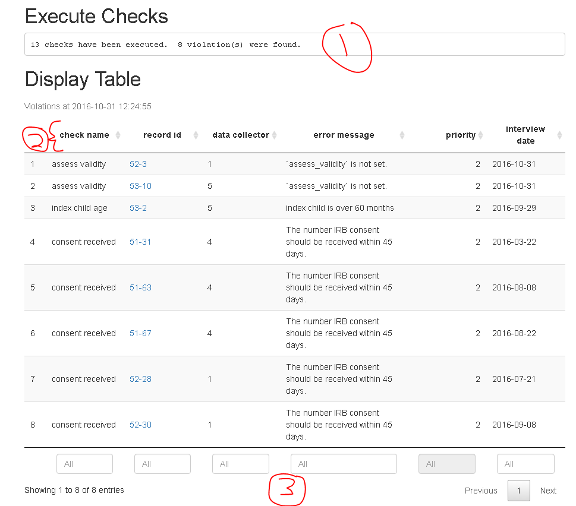

<style type="text/css">
.small-code pre code {
   font-size: 1.1em;
}
</style>


BBMC Validator: catch and communicate data errors
========================================================

OUHSC [Statistical Computing User Group](https://github.com/OuhscBbmc/StatisticalComputing)

Will Beasley<sup>1</sup>, Geneva Marshall<sup>1</sup>,<br/>Som Bohora<sup>2</sup>, & Maleeha Shahid<sup>2</sup>.


1. Biomedical and Behavioral Methodology Core ([BBMC](http://ouhsc.edu/BBMC/))
1. Center on Child Abuse and Neglect ([CCAN](https://www.oumedicine.com/department-of-pediatrics/department-sections/devbehav/center-on-child-abuse-and-neglect))

[November 1, 2016](https://github.com/OuhscBbmc/StatisticalComputing/tree/master/2016-presentations/11-november)


Objectives for Validator Software
========================================================

1. catches & displays data entry errors,
1. communicates problems to statisticians,
1. communicates problems to data collectors and managers<br/>(who typically have some tech phobia),
1. executes with automation, and
1. produces self-contained report file that can be emailed. 


`validation_check` S3 object
========================================================

```r
validation_check <- function( 
  name, error_message, priority, passing_test 
) {
  # S3 object to check
  l <- list()
  class(l)         <- "check"
  l$name           <- name
  l$error_message  <- error_message
  l$priority       <- priority
  l$passing_test   <- passing_test
  return( l )
}
```


Declare List of Checks
========================================================
class: small-code

```r
# Add to this list for new validators.
checks <- list(
  validation_check(
    name          = "record_id_no_white_space",
    error_message = "'record_id' contains white space.",
    priority      = 1L,
    passing_test  = function( d ) {
      !grepl("\\s", d$record_id, perl=T)
    }
  ),
  validation_check(
    name          = "interview_started_set",
    error_message = "`interview_started` can't be missing.",
    priority      = 2L,
    passing_test  = function( d ) {
      !is.na(d$interview_started)
    }
  ),
  ...
)
```

Execute Checks
========================================================
class: small-code

```r
for( check in checks ) {
  index <- length(ds_violation_list) + 1L
  violations <- !check$passing_test(ds_interview)
  ds_violation <- ds_interview %>%
    dplyr::filter(violations)


  if( nrow(ds_violation) > 0L ) {
    ds_violation_list[[index]] <- extract_violation_info(ds_violation, check)
  }
  rm(violations, ds_violation)
}
```

Display Failures as HTML
========================================================
class: small-code

```r
DT::datatable(
  data         = ds_violation_pretty,
  filter       = "bottom",
  caption      = paste("Violations at", Sys.time()),
  escape       = FALSE,
  options      = list(pageLength = 30, dom = 'tip')
)
```

Save Failures as CSV
========================================================
class: small-code

```r
# ---- save-to-disk ----------------------------------
message("Saving list of violations to `", path_output, "`.")

readr::write_csv(ds_violation, path=path_output)
```

Live Products
========================================================

* [CSV of Violations](https://github.com/OuhscBbmc/StatisticalComputing/blob/master/2016-presentations/11-november/survey-violation.csv).
* [Self-explanatory & portable report](https://rawgit.com/OuhscBbmc/StatisticalComputing/master/2016-presentations/11-november/survey-validation.html) (hopefully).

Table of Violations
========================================================


Portable HTML Report
========================================================


Important Characteristics
========================================================
 
1. No PHI within report.<br/>*Because you can't control where it will be emailed*.
1. URLs link to PHI within REDCap.<br/>*Let REDCap handle all the authentication duties*.
1. Sortable & filterable table.<br/>*By date, user, error type*.
1. Portable & disconnected report.<br/>*The data collectorsaren't always OUHSC employees or on campus.*
1. Database agnostic.<br/>*Accommodates REDCap, SQL Server, CSV, ...*


Human Considerations
========================================================
1. Each check should be easy to understand
1. Each violation should be easy (as possible) to fix
1. Send reports frequently to data collectors
    * So the list doesn't become overwhelmingly large
    * So the cases are fresh on their minds
1. *What other suggestions do you have?*


Upcoming Features
========================================================
1. Report runs updates every 10 minutes, and is displayed in Shiny.
1. Report-level checks will supplement the record-level checks.<br/>(*e.g.*, "At least 30% of participants should be female.")
1. Graph performance of each data collector<br/>(suggested by [Geneva Marshall](http://ouhsc.edu/bbmc/team/))

Generalizable
========================================================
* We want this mechanism to be used in almost all our research that involves live data collection.  We'll also make this publically available.
* Ideally, a single mechanism accommodates all these types of research.
* How could this be modified/expanded to accommodate your type of research and human environments?
