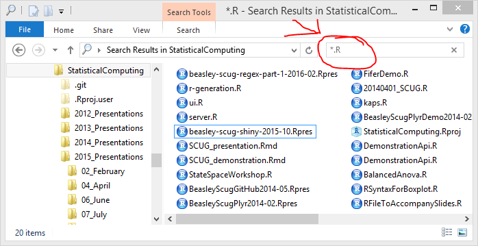
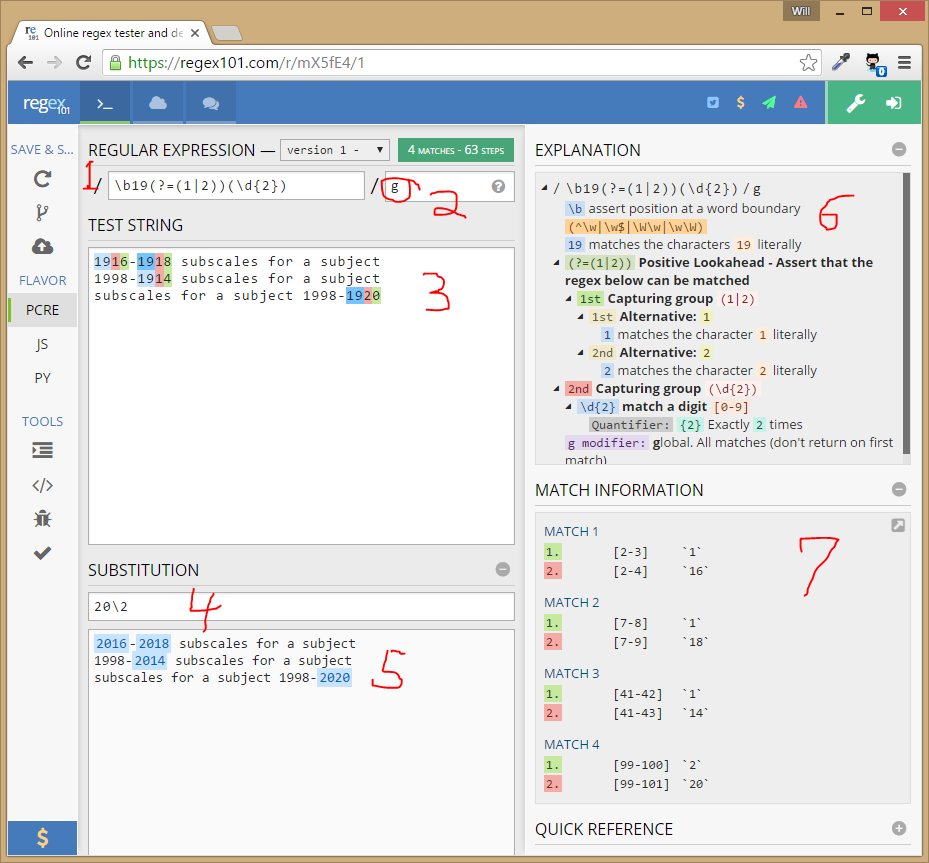

<style type="text/css">
.small-code pre code {
   font-size: 0.8em;
}
</style>


Text Manipulation with Regular Expressions Part 2
========================================================

OUHSC [Statistical Computing User Group](https://github.com/OuhscBbmc/StatisticalComputing)

Will Beasley, Dept of Pediatrics,

Biomedical and Behavioral Methodology Core ([BBMC](http://ouhsc.edu/BBMC/))

[November 5, 2019](https://github.com/OuhscBbmc/StatisticalComputing/tree/master/2019-presentations/11-november/)

(Based of the presentation from [May 3, 2016](https://github.com/OuhscBbmc/StatisticalComputing/tree/master/2019-presentations/10-october/))


Agenda
========================================================

* Review of [Regex Part 2](https://rawgit.com/OuhscBbmc/StatisticalComputing/master/2016-presentations/02-february/beasley-scug-regex-part-1-2019-10.html) from last month
* Introduce a few more language-agnostic techniques
* Apply in a few languages

Environments
========================================================

* Text editors
    * Notepad++, Atom, Visual Studio Code, or anything else halfway-serious
* Languages
    * R, Python, SAS, & most others.
* Databases
    * First-class support in [Postgres](http://www.postgresql.org/docs/9.3/static/functions-matching.html) with succinct `~` and in [MySQL](http://dev.mysql.com/doc/refman/5.7/en/regexp.html) with `REGEXP`.  And in  [Oracle](https://docs.oracle.com/cd/B19306_01/appdev.102/b14251/adfns_regexp.htm) with `REGEXP_SUBSTR` and `REGEXP_LIKE`, and even `REGEXP_REPLACE`.
    * It's tricky, [but possible](http://stackoverflow.com/questions/24037982/how-used-regexp-in-sqlite) with [SQLite](http://www.sqlite.org/lang_expr.html) and [SQL Server](http://www.codeproject.com/Articles/42764/Regular-Expressions-in-MS-SQL-Server).
    * The standard/portable [`LIKE`](http://www.w3schools.com/sql/sql_like.asp) SQL operator might do everything you need anyway, if you have only a simple comparison.


Overview of Regular Expressions
========================================================

A 'regex' is typically a carefully crafted string that describes a pattern of text.  It can:
* Extract components of the text,
* Substitute components of the text, or
* Determine if the pattern simply appears in the text.


Generalization of Simple Wildcards
========================================================
It's like the big brother of wildcards you match filenames with<br/>(eg, `"*.R"`).




Simple Examples
========================================================

| Pattern           | Matches                        |
| ----------------- | ------------------------------ |
| **`mike`**        | "mike", "smike", "miked", etc. |
| **`mike4`**       | "mike4", "smike4", etc. |
| **`mike\d`**      | "mike" followed by any single digit (eg "mike8", "smike8") |
| **`mike\d+`**     | "mike" followed by one or more digits (eg "mike1234", "smike8") |
| **`^mike$`**      | only "mike" |


Complicated Example
========================================================
`\b19(?=(1|2))(\d{2})\b`  and `20\2`<br/>[converts years](https://regex101.com/r/mX5fE4/2) in the 1910s and 1920s to the 2010s and 2020s<br/>(but leaves later years as they are).

[](https://regex101.com/r/mX5fE4/2)


Today's Tools
========================================================

* An online regex tester, **regex101** (https://regex101.com/).
* Example "subject" text [in SCUG repo](https://github.com/OuhscBbmc/StatisticalComputing/tree/master/2016-presentations/02-february/). <br/>(Google "OU scug github".)
* A local text editor, choose one of the following:
    * **Atom** (https://atom.io/).
    * **Notepad++** (https://notepad-plus-plus.org/).
* Today's as language agnostic as possible.  SAS, R, and Python examples in Part 2.

* Later, consider [RegexBuddy](http://www.regexbuddy.com/) for $40.


Cautions
========================================================
* There's no single "regular expression" specification.  Each language (eg, Python, R, Java) have slightly different flavors.
* There are two main branches of the specification.  We'll concentrate on
    * the "Perl" branch (eg, `"\d\w"`) instead of
    * the "Posix" branch (eg, `"[:digit:][:alnum:]"`)
* Don't forget the "g" option in regex101.com


Python Functions
===================================
* Start with

    ```python
    `import re`
    ```
* `search()` --the first match.

    ```python
    m = re.search('(?<=a)d', 'ad')
    m.group(0)
    ```

* `findall()`  --all non-overlapping matches.
* `match()` --careful, needs to be at the start.
* `sub()`


Example 1
===================================
* Identify years in the 1990s, *or*
* Identify years ending in 7, 8, or 9, *or*
* Identify lines starting with a year, *or*
* "Capture" the century of each year, *or*
* Think of something else.

```
1916-1918 subscales for a subject
1998-1914 subscales for a subject
subscales for a subject 1998-1920
```


R Functions in Base Package
===================================
* `grep()` and `grep(..., value=T)`
* `grepl()`
* `sub()` and `gsub()`
* `regexpr()`, `gregexpr()`, `regexec()`
* Like most R functions, it's designed for vectors.
    * Careful with subtle differences from documentation for other languages.
    * Usually, the differences work out for the best.

R Functions in Other Packages
===================================
* **stringr** has been around 10+ years and has some good extraction functions.
* **rematch2** is fairly new and become my preference in some scenarios.

* My advice:
    1. See if you can do it naturally with `grep()`, `grepl()`, `sub()` or `gsub()`.
    1. If not, move to **match2** package.
    1. Avoid the low-level functions (*i.e.*, `regexpr()`, `gregexpr()`, & `regexec()`)


Escalation of R Functions (1 of 3)
===================================


```r
cols <- c("id", "dx1", "dx2", "dx3", "dx4dx")
pattern <- "^(dx)(\\d)$"

grep( pattern, cols)
```

```
[1] 2 3 4
```

```r
grep( pattern, cols, value=T) # equivalent: cols[grep(pattern, cols)]
```

```
[1] "dx1" "dx2" "dx3"
```

```r
grepl(pattern, cols)
```

```
[1] FALSE  TRUE  TRUE  TRUE FALSE
```

Escalation of R Functions (2 of 3)
===================================

```r
sub("dx", "pz", cols)
```

```
[1] "id"    "pz1"   "pz2"   "pz3"   "pz4dx"
```

```r
gsub("dx", "pz", cols)
```

```
[1] "id"    "pz1"   "pz2"   "pz3"   "pz4pz"
```

```r
rematch2::re_match(cols, pattern)
```

```
# A tibble: 5 x 4
  ``    ``    .text .match
  <chr> <chr> <chr> <chr> 
1 <NA>  <NA>  id    <NA>  
2 dx    1     dx1   dx1   
3 dx    2     dx2   dx2   
4 dx    3     dx3   dx3   
5 <NA>  <NA>  dx4dx <NA>  
```

Escalation of R Functions (3 of 3)
===================================

Named capture group produces column names (*e.g.*, `?<index>`).

```r
pattern_named <- "^(?<type>dx)(?<index>\\d)$"

rematch2::re_match(cols, pattern_named)
```

```
# A tibble: 5 x 4
  type  index .text .match
  <chr> <chr> <chr> <chr> 
1 <NA>  <NA>  id    <NA>  
2 dx    1     dx1   dx1   
3 dx    2     dx2   dx2   
4 dx    3     dx3   dx3   
5 <NA>  <NA>  dx4dx <NA>  
```

```r
rematch2::re_match(cols, pattern_named)$index
```

```
[1] NA  "1" "2" "3" NA 
```

```r
library(magrittr)
```

Full **rematch2** example
===================================

Named capture group produces column names (*e.g.*, `?<index>`).

```r
pattern_2 <- "^(?<gender>m|f)(?<age>\\d)$"
tibble::tibble(
  raw = c("m3", "f4", "f5", "m2")
) %>%
rematch2::bind_re_match(raw, pattern_2)
```

```
  raw gender age
1  m3      m   3
2  f4      f   4
3  f5      f   5
4  m2      m   2
```

Example 1 in R
===================================


```r
s <- c("1916-1918 subscales for a subject", "1898-2003 subscales for a subject", "subscales for a subject 1998-1920")

g <- sub("19(1|2)(\\d)", "20\\1\\2", s)
cat(g, sep="\n")
```

```
2016-1918 subscales for a subject
1898-2003 subscales for a subject
subscales for a subject 1998-2020
```

```r
grep("19(1|2)(\\d)",  s)
```

```
[1] 1 3
```

```r
grep("19(1|2)(\\d)",  s, value=T)
```

```
[1] "1916-1918 subscales for a subject" "subscales for a subject 1998-1920"
```

```r
grepl("19(1|2)(\\d)",  s)
```

```
[1]  TRUE FALSE  TRUE
```


Strategies and Advice, Part 1
===================================
* Start in a regex tester.
* Start small/simple, then slowly build complexity & generality.
    * In the regex.
    * In the example/subject text.
* Leave a breadcrumb trail<br/>(ie, progression of simpler regexes, commented out).
* Include comments to help others and you later.
* Short-term: use the right-panels of regex101.com.


R-Specific Strategies and Advice
===================================
Use the simplest function for the job:
* `sub()` instead of `gsub()`
* `re_match()` instead of `re_match_all()` (in rematch2 package)


Stack Overflow Regex Advice
===================================
Detailed advice for asking regex questions to people outside of your specific project:

1. https://meta.stackexchange.com/questions/222498/how-to-ask-a-good-regex-question
1. https://stackoverflow.com/tags/regex/info

Here's an example of one of my regex questions: https://stackoverflow.com/questions/55270833/regex-to-qualify-n
Example 2
===================================
* **Blacklist**: Flag the bad numeric values.  (Sometimes "bad" is a subjective decision.)
* **Whitelist**: Permit only the good values.

```
1234
23

14a
1a3

 234
1.39
```


Study the List of Tokens and Quantifiers
===================================
In the right panel of bottom right panel of regex101.com.  Especially these first:

```
. versus \.
\w and \d and \s (versus \W and \D and \S)
^ and \A
$ and \Z
? and * and + and things like {3,6}
Capturing
Character classes
```


Example 3
===================================
* Swap the columns.

```
"CL_ID"            = "ClientID"
, "RMSEQ"          = "RemovedSequence"
, "RMVL_BEGDT"     = "RemovalBeginDate"
, "RMVL_ENDDT"     = "RemovalEndDate"
, "END_TYP_CDE"    = "EndTypeID"
, "REMOVED_FROM"   = "RemovedFromTypeID"
, "CURR_RMVL_TYP"  = "RemovalTypeCurrentID"
, "ORIG_RMVL_TYP"  = "RemovalTypeOriginalID"
, "FMLY_STRUCTURE" = "FamilyStructureTypeID"
```

Strategies and Advice, Part 2
===================================
* Anticipate misbehaving subject that you haven't seen yet.
* Try variations of the solutions.  There are usually 10 solutions, each with strengths and weaknesses.
    * Robustness.
    * Readability & maintainability.
    * Generality.
* Create very selective regexes that loudly fail when they encounter subject text that you haven't anticipated.
* Long-term: read and reread[*Regular Expressions Cookbook*](http://shop.oreilly.com/product/0636920023630.do), esp Ch 2.


Example 4
===================================
* Erase the "quietly" parameters.
    * In a single file
    * In many files

```
requireNamespace("dplyr", quietly=TRUE) #hadley/dplyr
requireNamespace("lubridate")
requireNamespace("OuhscMunge", quietly=T) #OuhscBbmc/OuhscMunge
```

Example 5
===================================
* Pad single digits with zeros (eg, "4" becomes "04")

```
9
4
34
3
62
43
1
```


Example 6
===================================
* Extract the cage ID
* Extract the mouse ID (within the cage)

```
Time,Gender,Genetype,Treatment,MouseID,OR-Recognition Index,FC-t-F %,FC-b-F %,FC-a-F %
4M,Male,WILD,Control,c9-1,0.32,11.9,0,25.7
4M,Male,WILD,Control,c13-2,0.47,23.7,0,11.
4M,Male,WILD,Prozac,c10-2,0.62,40.7,11.4,51.4
4M,Male,WILD,Prozac,c14-3,0.63,10.2,0,28.6
4M,Male,YFP,Control,c9-2,0.42,42.4,11.4,22.9
4M,Male,YFP,Control,c13-1,0.5,15.3,0,54.1
4M,Male,YFP,Control,c13-nm,1,27.1,0,31.4
4M,Male,YFP,Prozac,c10-1,0.65,20.3,17.1,54.3
```

(In some cases, you'd have to parse only the cell, not the entire line.  But this is good practice.)


Proceed However You'd Like
===================================
* Work by yourself or in pairs.
* After you're done with these 6 exercises,
    * Invent new challenges
    * Help someone else
    * Check the solutions I thought of.


Potential Solutions for 3 & 4
===================================

Example 3
```
(,*\s*)"(\w+)"\s+=\s+"(\w+)" and
$1"$3"    = "$2"
```

Example 4
```
library\((\w+),\s*quietly=(T|TRUE)\) and
library($1)
```

Potential Solutions for 5 & 6
===================================

Example 5
```
\b(\d)\b and
0$1
```

Example 6
```
,c(\d{1,2})-(\d|nm),
```
